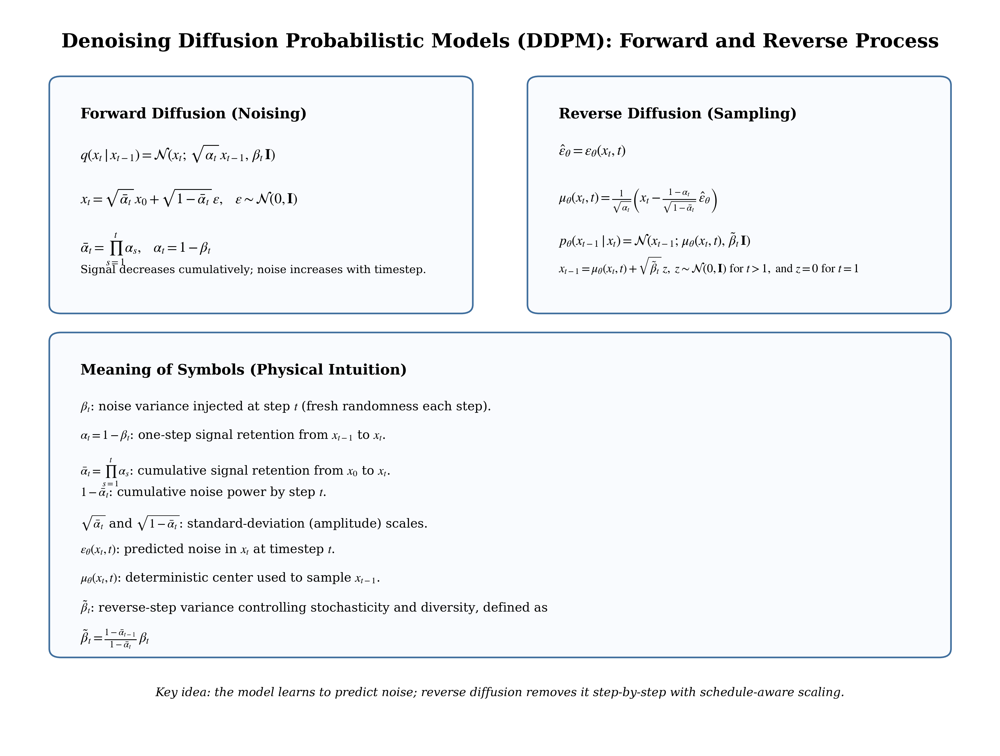
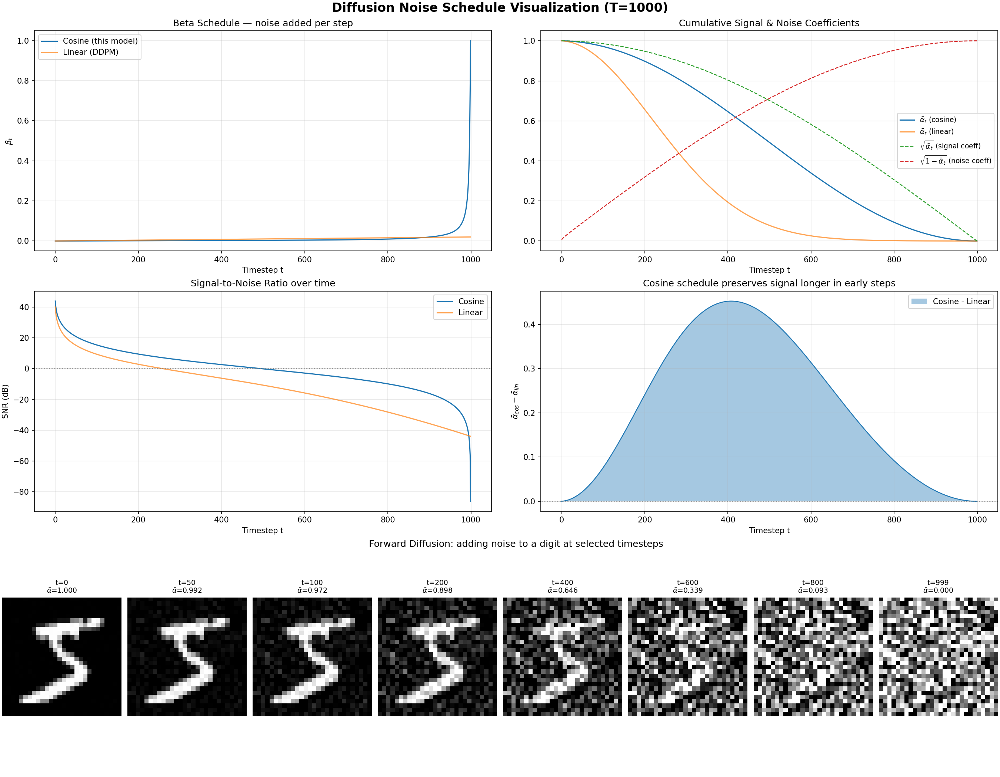

# MNIST Diffusion
> Forked from https://github.com/bot66/MNISTDiffusion


Only simple depthwise convolutions, shorcuts and naive timestep embedding, there you have it! A fully functional denosing diffusion probabilistic model while keeps ultra light weight **4.55MB** (the checkpoint has 9.1MB but with ema model double the size).

## Training
Install packages
```bash
pip install -r requirements.txt
```
Start default setting training 
```bash
python train_mnist.py
```
Feel free to tuning training parameters, type `python train_mnist.py -h` to get help message of arguments.

### Train and resume
Train with custom settings (saves checkpoints and samples each epoch into `results/`):
```bash
python train_mnist.py --epochs 60 --batch_size 128 --lr 0.0003 --model_base_dim 64
```
Resume from a checkpoint:
```bash
python train_mnist.py --ckpt results/steps_00001000.pt --epochs 20
```
Device selection defaults to CUDA, then MPS, then CPU.

### Sampling and visualization
During training, a grid of samples is saved as `results/steps_XXXXXXXX.png`.
You can also sample from a checkpoint directly with a short script:
```bash
python - <<'PY'
import math
import torch
from torchvision.utils import save_image
from model import MNISTDiffusion
from utils import ExponentialMovingAverage

if torch.cuda.is_available():
    device = "cuda"
elif torch.backends.mps.is_available():
    device = "mps"
else:
    device = "cpu"
ckpt = torch.load("results/steps_00001000.pt", map_location=device)

model = MNISTDiffusion(timesteps=1000, image_size=28, in_channels=1, base_dim=64, dim_mults=[2, 4]).to(device)
ema = ExponentialMovingAverage(model, device=device, decay=0.0)
ema.load_state_dict(ckpt["model_ema"])

ema.eval()
samples = ema.module.sampling(36, clipped_reverse_diffusion=True, device=device)
save_image(samples, "results/samples_from_ckpt.png", nrow=int(math.sqrt(36)))
print("saved results/samples_from_ckpt.png")
PY
```
Tip: pass `--no_clip` during training if you want to compare unclipped sampling (can be less stable).

### Forward diffusion and reverse sampling (math + intuition)
The figure below summarizes the full forward pass, reverse pass, and the physical meaning of `alpha`/`beta` used in this implementation.



## Visualize noise schedule
Use the provided script to generate a figure that explains the cosine schedule and forward diffusion behavior:
```bash
python visualize_schedule.py
```
The script saves the plot to:
```bash
figures/noise_schedule.png
```
It includes:
- Beta schedule comparison (cosine vs linear)
- Cumulative signal/noise coefficients
- SNR over timesteps
- Forward diffusion snapshots of a sample MNIST digit



## Reference
A neat blog explains how diffusion model works(must read!): https://lilianweng.github.io/posts/2021-07-11-diffusion-models/

The Denoising Diffusion Probabilistic Models paper: https://arxiv.org/pdf/2006.11239.pdf 

A pytorch version of DDPM: https://github.com/lucidrains/denoising-diffusion-pytorch

